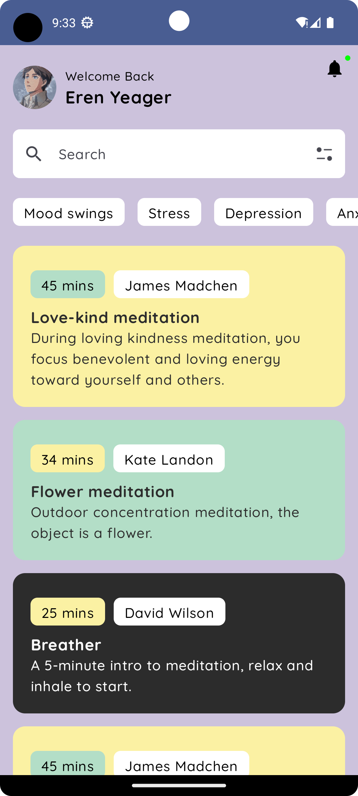

  

---

# Meditation App

This is a meditation app built with Kotlin and Jetpack Compose.

## Features

- Clean and intuitive user interface
- Customizable meditation sessions
- Option to save favorite meditations
- Timer with sound and vibration options

## Requirements

- Android Studio Flamingo (2022.2.1) or later
- Android device running Android 7.0 (Nougat) or later

## Installation

1. Clone the repository to your local machine
2. Open the project in Android Studio
3. Connect your Android device to your computer and select "Run" from the toolbar

## Usage

- Choose a meditation session from the home screen
- Customize the session by selecting different options
- Start the timer and enjoy your meditation
- Save your favorite meditations by pressing the heart icon

## Contributing

Contributions are always welcome! If you'd like to contribute to the project, please open an issue or submit a pull request.

## Credits

This app was created by [Me](github.com/DashingAdi). Thanks to the following resources for their contributions:

- [Jetpack Compose documentation](https://developer.android.com/jetpack/compose)
- [Android Kotlin Fundamentals codelabs](https://developer.android.com/courses/kotlin-android-fundamentals/overview)

## License

This project is licensed under the MIT License - see the [LICENSE](LICENSE) file for details.
